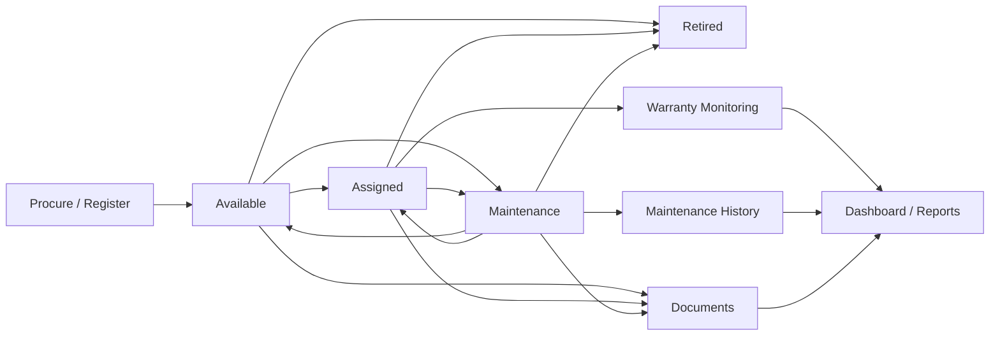
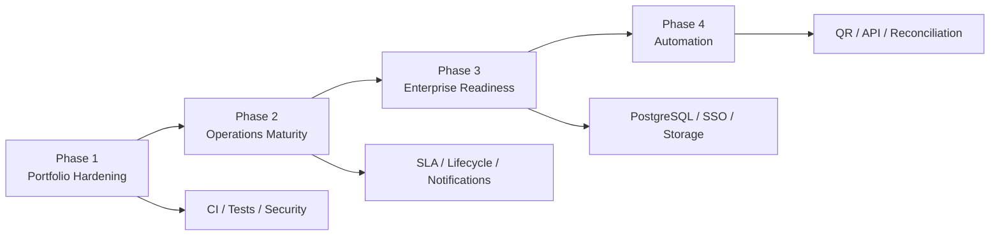

# IT Asset Tracking & Maintenance Management System


A portfolio-grade Flask application for tracking hardware assets, ownership, warranty status, maintenance activity, supporting documents, and operational audit history.

The project is designed around a realistic IT operations workflow: **register → assign → maintain → review → retire**, with role-based access and reporting.

## Demo

### Dashboard


### Maintenance records


### Asset list


## What problem does this solve?

IT operations teams often maintain hardware inventory, assignment, warranty, and maintenance information across multiple spreadsheets. This project consolidates those workflows into one application with auditability.

Key use cases:

- maintain a centralized hardware asset register;
- track assignment, department, location, and lifecycle status;
- identify warranty risk;
- schedule and record maintenance;
- attach supporting documents;
- import/export operational data through Excel;
- separate Admin and Engineer responsibilities;
- retain activity history for governance and review.

## System flow



For deeper design details, see [System Architecture](docs/ARCHITECTURE.md).

## Features

### Asset management
- create, view, edit, and retire hardware assets;
- asset tag and serial-number tracking;
- category, brand, model, vendor, department, assignment, location, status, and condition;
- search, filtering, pagination;
- Excel import/export.

### Maintenance management
- schedule maintenance per asset;
- Engineer and Admin maintenance access;
- edit maintenance progress;
- maintenance history per asset;
- report export;
- overdue maintenance KPI.

### Warranty & dashboard
- total / active / assigned / retired asset KPIs;
- expired / critical / warning warranty bands;
- category, department, and vendor distribution;
- maintenance-due visibility.

### Document management
- PDF, DOCX, PPTX, XLSX, and TXT uploads;
- file metadata extraction;
- download/delete control;
- 50 MB request limit by default.

### Governance
- Flask-Login authentication;
- Admin / Engineer roles;
- CSRF protection for POST actions;
- HTTP-only and SameSite session cookies;
- Admin-only activity audit log;
- activity tracking for key operations.

## Role model

| Capability | Admin | Engineer |
|---|:---:|:---:|
| View dashboard/assets | ✓ | ✓ |
| Export reports | ✓ | ✓ |
| Create/edit asset master | ✓ | — |
| Upload/delete documents | ✓ | — |
| Create/edit maintenance | ✓ | ✓ |
| Delete maintenance | ✓ | — |
| View audit log | ✓ | — |

## Tech stack

| Area | Technology |
|---|---|
| Backend | Python 3.11, Flask |
| ORM | Flask-SQLAlchemy / SQLAlchemy |
| Authentication | Flask-Login |
| CSRF | Flask-WTF |
| Database | SQLite by default; `DATABASE_URL` supported |
| Frontend | Jinja2, Bootstrap 5, JavaScript |
| Charts | Chart.js |
| Excel | Pandas, Openpyxl |
| Documents | PyPDF2, python-docx, python-pptx |
| WSGI | Gunicorn |
| Deployment | Docker / Render |
| CI | GitHub Actions |

## Quick start

```bash
git clone https://github.com/BAPP18/Automation-Hardware-Asset-Tracking-and-Maintenance-Management-System.git
cd "Automation-Hardware-Asset-Tracking-and-Maintenance-Management-System/Automation Hardware Asset Tracking and Maintenance Management System/asset-management-system"

python -m venv .venv
source .venv/bin/activate
pip install -r requirements.txt

export SECRET_KEY="local-dev-secret"
export SEED_DEMO_DATA=true

python app.py
```

Windows PowerShell:

```powershell
$env:SECRET_KEY="local-dev-secret"
$env:SEED_DEMO_DATA="true"
python app.py
```

Open: `http://127.0.0.1:5000`

## Demo data

Demo users and sample assets are created **only when**:

```text
SEED_DEMO_DATA=true
```

Default local demo credentials:

| Role | Username | Password |
|---|---|---|
| Admin | admin | admin123 |
| Engineer | engineer1 | eng123 |

Do **not** enable demo seeding on an internet-facing production deployment.

## Production configuration

Recommended minimum environment:

```text
APP_ENV=production
SECRET_KEY=<strong-random-secret>
SEED_DEMO_DATA=false
SESSION_COOKIE_SECURE=true
DATABASE_URL=<managed-database-url>
```

The application will refuse to start in production without `SECRET_KEY`.

Health endpoint:

```text
GET /health
```

## Testing

```bash
python -m compileall -q .
python -m unittest discover -s tests -v
```

GitHub Actions automatically runs smoke tests and validates the Docker image.

## Repository structure

```text
.
├── .github/workflows/ci.yml
├── .env.example
├── Dockerfile
├── render.yaml
├── SECURITY.md
├── CONTRIBUTING.md
├── docs/
│   ├── ARCHITECTURE.md
│   └── PROJECT_MANAGEMENT.md
└── Automation Hardware Asset Tracking and Maintenance Management System/
    └── asset-management-system/
        ├── app.py
        ├── config.py
        ├── models/
        ├── routes/
        ├── services/
        ├── utils/
        ├── templates/
        ├── static/
        ├── screenshots/
        └── tests/
```

> The long nested application path is retained for backward compatibility with the existing deployment setup. Flattening it into a simpler `src/` or app-root structure is recommended as a future refactor.

## Project management view

This repository is also documented as an IT operations improvement project, not just a coding exercise.

See [Project Management Framework](docs/PROJECT_MANAGEMENT.md) for:

- business objectives;
- scope / out-of-scope;
- WBS;
- RACI;
- operational KPIs;
- risk register;
- phased roadmap.

Recommended KPIs include:

- asset data completeness;
- maintenance on-time rate;
- overdue maintenance volume;
- warranty-at-risk coverage;
- assignment accuracy;
- audit coverage;
- Excel import error rate.

## Current engineering limitations

The current version is suitable for a portfolio/demo environment. For real enterprise deployment, the highest-priority next steps are:

1. PostgreSQL + migration framework;
2. SSO/MFA and login rate limiting;
3. object storage + malware scanning for uploads;
4. lifecycle transition service;
5. normalized Engineer/User ownership in maintenance records;
6. background scheduler for warranty/maintenance reminders;
7. structured observability and backup/restore procedures;
8. REST API and integration layer.

## Roadmap



## Security

See [SECURITY.md](SECURITY.md). Generated databases, credentials, environment files, logs, uploads, and exports should not be committed.

## License

MIT License — see [LICENSE](LICENSE).

## Portfolio intent

This project demonstrates:

- full-stack Flask development;
- database modeling;
- RBAC;
- secure configuration;
- file and Excel workflows;
- IT asset lifecycle management;
- maintenance operations;
- auditability;
- Docker/cloud deployment;
- CI/testing;
- software-engineering and project-management documentation.
