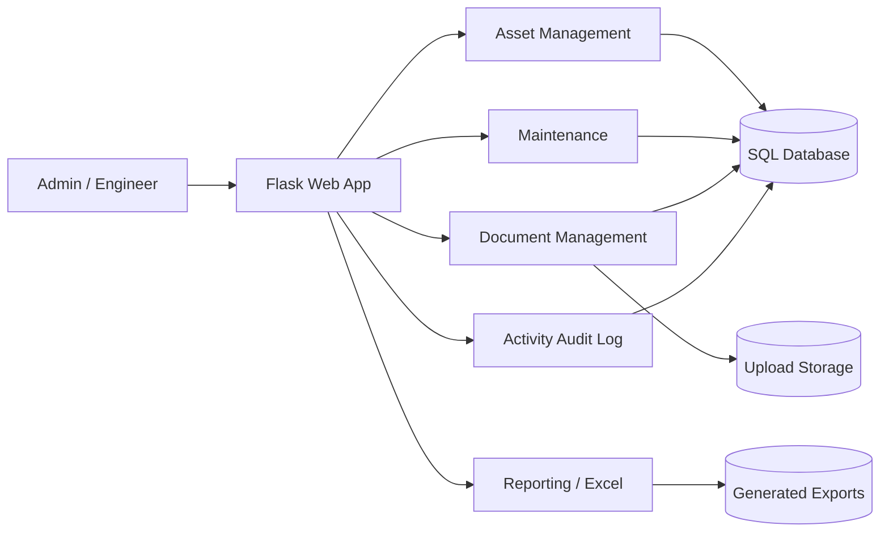
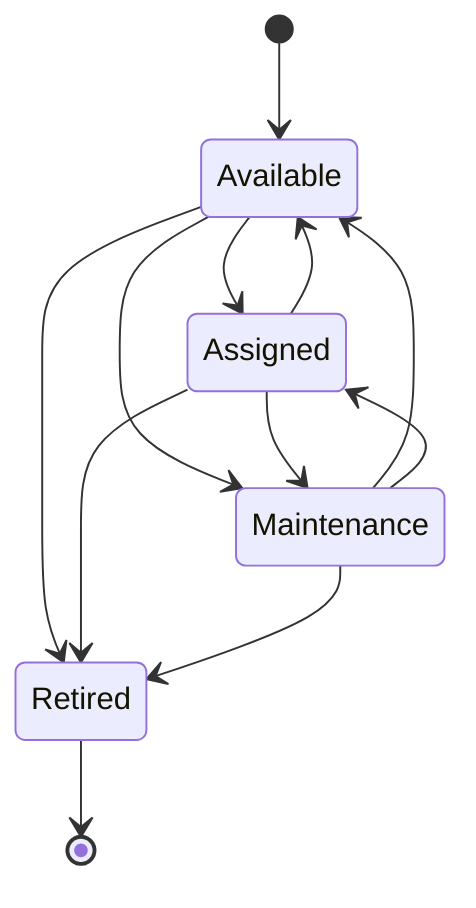
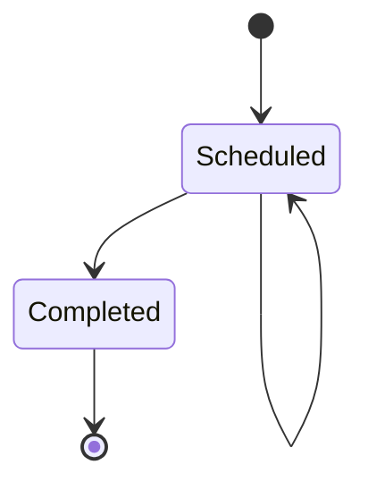

# System Architecture

## Context

The application supports a practical IT operations workflow around hardware ownership, assignment, maintenance, documents, warranty monitoring, and auditability.

## Application layers

| Layer | Responsibility | Location |
|---|---|---|
| Web routes | HTTP flow, permissions, request/response | `routes/` |
| Services | Import/export/file/business operations | `services/` |
| Domain models | Asset, maintenance, user, vendor, department, documents | `models/` |
| Presentation | Jinja templates, Bootstrap, Chart.js | `templates/`, `static/` |
| Persistence | SQLAlchemy + SQLite/default or `DATABASE_URL` | `database/` / external DB |

## Asset lifecycle

Current application stores status directly. A future version should formalize lifecycle transition rules in a service layer so invalid transitions cannot be introduced by UI or import.

## Maintenance lifecycle

Recommended future statuses: `Planned`, `Scheduled`, `In Progress`, `Blocked`, `Completed`, `Cancelled`.

## Deployment

- Local demo: Flask + SQLite
- Container: Gunicorn, non-root user
- Render: production env + generated secret + health check
- Future enterprise: PostgreSQL + object storage + managed secrets + observability
